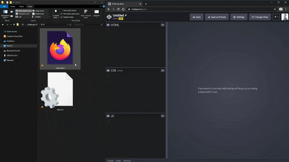

# Kevin Powell's Conquering responsive layouts

## Day 0 | Introduction

### Intro & Why the course is formatted this way

[VIDEO]

### Asking Questions

[VIDEO]

In the video, I mention the #welcome channel, but I've moved where you can add the correct role to gain access.

Once you join with the link below, go to the #😍-reaction-roles channel and click the CRL icon as I show in the video to add the role and gain access to the channels.

Join my Discord community with this link: https://discord.gg/9Rc6WNhNGJ

### My editor and a usefull extension

[VIDEO]

VS Code - https://code.visualstudio.com/

Live Server - https://marketplace.visualstudio.com/items?itemName=ritwickdey.LiveServer

## Day 1 | Using percentage & avoiding heights

### Percentage vs Fixed widths on the parent

[VIDEO]

### Percentage on the child

[VIDEO]

### Why it's a good idea to avoid heights

[VIDEO]

This is a general rule. There are times when you want to use height, but for the most part, they cause more issues than they solve.

It's very rare that I ever use height, and we'll see why in this lesson.

Em vs rem - https://youtu.be/_-aDOAMmDHI

#### OBSERVACIONES

  La unidad 'rem' siempre tiene que ver con el tamaño de la tipografía en el elemento html{} o en su equivalente `:root {...}`.

Tanto 'rem' como 'em' suelen ser usados en padding, margin, width, height, 

Si utilizamos la unidad 'em', font-size siempre buscar el tamaño de fuente del parent. Para padding y margin, siempre busca el tamaño de fuente de dicho elemento y no de su parent.

Por lo tanto:

- Se recomienda usar 'rem' para determinar el font-size.
- Se recomienda usar 'rem' para determinar el margin así toma siempre referencia fija a 16px.
- Se recomienda usar 'em' para determinar padding y margin ya que tiene sentido tomar su valor de acuerdo al tamaño de fuente (font-size) local.

Para botones se suele usar: `padding: 1em 3em;`

### About the challenges

I'm about to issue you your first challenge!

These challenges are for you, to help you reinforce what you are learning.

If you'd like to submit your solution, or if ever you are stuck on a challenge, head on over to the Discord. There is a channel-specific to posting solutions, and you can ask people for feedback there too 😊.

The early challenges aren't difficult, but they're important to do. One of the biggest issues people run into is running into tutorial hell. They watch tutorials, they understand them all, and then when they go to work on a project, they're stuck.

So even if the challenge seems simple, go and do it! It won't take you long, and it'll reinforce what you're learning.

As for submitting the challenges, once again, Discord is the best place to get feedback. There is no way to submit them directly to me. I'd love to be able to check them all, but with 10,000+ people taking this challenge, it's just not possible! Thanks for understanding 😊

### Challenge #1

[VIDEO]

Here is a challenge to end today's lessons!

### Challenge #1 - Starting Files

[challenge01.zip]

Here are the files you'll need to complete the challenge to finish off today's lesson. Watch the next lesson to get the details on what you need to do.

### Information about the daily drip

As I said in the introduction to the course, this is intentionally set up as a daily drip. 

I occasionally get people asking me to unlock everything at once. With how the course is set up, I cannot do that without it affecting everyone, and for the most part, people enjoy the pacing.

It might seem a little slow at first, especially if you are familiar with some of the concepts I talk about early on, but the pace picks up a little as the course moves on, and this is 100% done on purpose. 

You may feel like you learn more when you can get through a lot of content at once, but it just feels like you are learning a lot.

Take your time, take what you are learning here and apply it to projects, and do the challenges :).

Also, if you *really* want to do a lot at once, once the content is unlocked you have it forever, so you can wait a few days and come back to go through several lessons at once if you really prefer that style of learning.

Enjoy the course!

## Day 2 | Getting familiar with relative units

### Getting familiar with relative units

#### Welcome to day 2 of the course!

There are no video lessons here today. These days are here to give you a chance to keep up if you fall behind, and also to provide some extra learning and resources for those who want to keep pushing.

#### Relative units

While you won't need to dive into relative units to get through this course, I do strongly suggest you learn how em and rem work, as they are essential in CSS today.

I have a [YT video on em and rem units](https://youtu.be/_-aDOAMmDHI), if you aren't already familiar with them, or if you struggle to know which one to use.

I also want to make sure that you completed the challenge. I'll be looking at the solution tomorrow, but I want to make sure you did it first, and this one shouldn't take you very long, so there are no excuses!

The easiest thing to do for them is to create a [CodePen](https://codepen.io/) or [JSFiddle](https://jsfiddle.net/).

In CodePen, you can super easily get started by dragging the challenge files right into the browser window!



If you see a challenge and say "that's too easy!" make sure you actually do it anyway. It'll reinforce what was covered, and it's all building up skills we'll need to complete later challenges and help you conquer responsive layouts.

### CSS em and rem explained

[VIDEO](https://youtu.be/_-aDOAMmDHI)

### Why you shouldn't set font-sizes using em

[VIDEO](https://youtu.be/pautqDqa54I)

## Day 3 | Enter max-width

### Challenge #1 - Solution

[VIDEO]

```css
* {
  box-sizing: border-box;
}

body {
  margin: 0;
  font-family: sans-serif;
}

.container {
  background: #23424a;
  color: white;

  width: 80%;
  margin: 0 auto;

  padding: 2em;
}

.intro-content {
  width: 50%;
}
```

### Adding in a max-width

[VIDEO]

As we saw, setting a fixed width on an element tends to be a bad idea. Instead we can use percentages, which make our lives easier.

The only issue with this is, at large screens, things can get too big. Thankfully, we have max-width that can help us out!

### Challenge #2

[VIDEO]

### Challenge #2 - Starting Files

[challenge02.zip]

### Some notes on the challenge

You are allowed to modify anything I've provided, including the HTML.

Also, I provided a little more than intended in the CSS, but in the next challenge I'm providing you with nothing at all as a starting point, so a little extra help in this one won't hurt 😅.

## Day 4 | Extra curricular activities

### Some extra material if you're interested

Today is a catch-up day, so no official lessons.

#### Extra-curricular

If you are eager to dive keep learning though, there has been some talk about **viewport units** in the Discord server.

Up next is a video where I take a look at them. **A word of warning though**, I do look at using them for font-size, and while cool, there are some accessibility issues with doing so, so I wouldn't suggest it unless it's just for a personal project of yours.

This is totally optional, and while they can be useful, they will not be something I'll be diving into in this course.

If you do like them and want to practice with them, there is no reason you can't incorporate them into future challenges though!

### CSS Units: vh, vw, vmin, vmax

[VIDEO](https://youtu.be/IWFqGsXxJ1E)

## Day 5 | Practice time!

### Challenge #2 - Solution

```html
<!DOCTYPE html>
<html lang="en">
<head> 
    <meta charset="UTF-8">
    <meta name="viewport" content="width=device-width, initial-scale=1.0">
    <title>Day 01</title>
 
    <link rel="stylesheet" href="style.css">
</head>
<body>
    <div class="section-one">
        <div class="container">
            <div class="section-one-content">
                <h1>Lorem ipsum dolor sit.</h1>
                <p>Lorem ipsum dolor sit amet consectetur adipisicing elit. Exercitationem aspernatur distinctio laudantium dolores. Nulla quibusdam reprehenderit eum sit minus aliquid!</p>
            </div>
        </div>
    </div>
    <div class="section-two">
        <div class="container">
            <div class="section-two-content">
                <h2>more content D:</h2>
                <p>Lorem ipsum dolor sit amet consectetur adipisicing elit. Perferendis, mollitia adipisci magnam voluptatibus repellendus fuga ut repellat exercitationem eaque amet, omnis aliquam fugiat laudantium id dicta at? Consectetur iure porro illum laudantium excepturi a laborum!</p>
                <p>Sit magni soluta porro fugit placeat eius itaque, accusamus quisquam voluptates reiciendis pariatur, vitae molestiae. Minima, quos reprehenderit autem animi, nisi necessitatibus eligendi quis modi, facilis ipsam nihil odit quaerat! Nisi doloribus harum culpa ipsam!</p>
                <p>Sint corporis animi repudiandae. Aliquid illum, tenetur magnam provident molestiae rem doloremque aspernatur quia reiciendis est facilis enim praesentium officia sequi qui debitis exercitationem quaerat hic quos recusandae. Architecto repudiandae aperiam tempora iste saepe error.</p>
                <p>Provident aut suscipit aspernatur doloribus illum assumenda cupiditate perferendis dolores! Obcaecati omnis magnam ipsam voluptas ipsa eos explicabo quisquam architecto similique, sunt repellendus animi a doloribus ab deserunt. Dicta neque nostrum modi, illum debitis dolorem.</p>
            </div>
        </div>
    </div>
</body>
</html>
```

```css
* {
  box-sizing: border-box;
}

body {
  margin: 0;
  font-family: sans-serif;
}

.section-one {
  background: #23424a;
  color: white;
  padding: 4rem 0;
}

.section-two {
  background: white;
  color: black;
  padding: 2rem 0;
}

.container {
  width: 80%;
  max-width: 750px;
  margin: 0 auto;
}

.section-one-content {
  width: 50%;
}

.section-two-content {
  /* border: 1px solid red; */
}
```

### Challenge #3

[VIDEO]

[Click here](https://www.figma.com/file/dGPcL6Ym2avOt4736aHb2B/conquer-responsive-layout-week-1-final-challenge?node-id=0%3A1) to access the Figma file

*There were some issues with the captions on this video so I've removed them while I get them fixed. Should be back up in mid-January

### challenge-design-specs.pdf

[challenge-design-specs.pdf]

## Day 6 | Review

### Review of the first week


**In this first week, we've looked at:**

- Using percentages for widths
- Avoiding to set heights
- Using max-width

While there is nothing overly complicated with any of that, **being comfortable with these things is *the key* to mastering responsive layouts**.

With a good understanding of the above, all we need is a little flexbox and we're going to start knocking even complex layouts out of the park!

In this section of the course, you can find a few links to some extra reading that you can do if you're looking to continue learning a bit. They'll help supplement what we're covering here, but none of it is required reading 😊.

**I'll be sharing my solution to the challenge tomorrow**. If you're a little bit behind at this point, you can use today and tomorrow to catch up a little.

**Next week, we'll be jumping into flexbox** and how we can use it with what we've already learned to make our layouts. We'll be looking at both the macro-scale with a page's layout, as well as the more micro-scale in putting together a common navbar component.

### Why you shouldn't use 'em's for font-size

[VIDEO](https://youtu.be/pautqDqa54)

### A Tale of width and max-width

[Click here](https://css-tricks.com/tale-width-max-width/)

An interesting look at the two properties, and how they might not always act the way you think they will. 

As it says, the second one is the easier one to understand, just like we looked at, so I plan on sticking with that one 😊

## Day 7 | Solution to challenge #3

### My solution to challenge #3

[VIDEO]

[Emmet documentation](https://docs.emmet.io/)

[Why I use the BEM naming convention for my CSS (video)](https://youtu.be/SLjHSVwXYq4)

[`box-sizing: border-box` (video)](https://youtu.be/WlGQdgy-M6w)

### challenge-finished.zip

[challenge-finished.zip]

The code from my solution.

## Day 8 | Flexbox Basics

### Flexbox basics

Flexbox was the first actual layout property given to us in CSS, which is wild because it was only added relatively recently.

This part of the course isn't a complete overview of flexbox, but more of a look at how we can quickly and easily use it to start making more interesting looking layouts.

We'll be starting with some simple columns setups, plus a nice trick to space things out. In the coming days, we'll be diving deeper in and making more fleshed out layouts.

Flexbox does do a few strange things, which we'll be exploring as well.

For the challenge, I've provided the design specs as a PDF. I've also provided the starting files both as a download to work locally on your computer, as well as a Codepen. Pick whichever you'd prefer 😊

### An introduction to flexbox

[VIDEO]

### Adding space in between columns

[VIDEO]

Hoy en día se puede realizar de forma sencilla con la propiedad `gap` en el contenedor flex.

Antes de la existencia de `gap` se utilizaba combinadores CSS. En el siguiente ejemplo vemos la utilización de un selector de elementos hermanos adyacentes `+` :

```css
.col + .col {
  margin-left: 1rem;
}
```

### Flexbox challenge #1

[VIDEO]

### Flexbox challenge #1 - Design Specs

[02-03-challenge-layout.pdf]

### Flexbox challenge #1 - starting files | HTML & CSS Files

[challenge-start.zip]

### Flexbox challenge #1 - starting files | Codepen

I've [created a CodePen of the challenge starting files](https://codepen.io/kevinpowell/pen/ZEbpGjE?editors=1100) as well. If you'd prefer, you can simply fork this and work from here instead of locally on your computer.

#### FINISHED CODE

```html
<!DOCTYPE html>
<html lang="en">
<head>
  <meta charset="UTF-8">
  <meta name="viewport" content="width=device-width, initial-scale=1.0">
  <title>Document</title>
  <link rel="preconnect" href="https://fonts.googleapis.com">
  <link rel="preconnect" href="https://fonts.gstatic.com" crossorigin>
  <link href="https://fonts.googleapis.com/css2?family=Roboto:wght@400;700;900&display=swap" rel="stylesheet">
  <link rel="stylesheet" href="style.css">
</head>
<body>
  <div class="section-hero">
    <div class="wrapper">
      <div class="hero__text">
        <h1 class="title roboto-black">Responsive layouts don’t have to be a struggle</h1>
        <p class="content roboto-regular">Lorem ipsum dolor sit amet, consectetur adipiscing elit, sed do eiusmod tempor incididunt ut labore et dolore magna aliqua. Ut enim ad minim veniam.</p>
        <a class="btn roboto-bold " href="#">I want to learn</a>
      </div>
    </div>
  </div>
  <section class="three-col">
    <div class="wrapper">
      <div class="row">
        <div class="col">
          <h2>Cheap</h2>
          <p>Lorem, ipsum dolor sit amet consectetur adipisicing elit. Exercitationem, expedita? Natus nesciunt aperiam saepe eum, dolores deleniti quasi iusto necessitatibus possimus facere laboriosam fugiat.</p>
        </div>
        <div class="col">
          <h2>Quick</h2>
          <p>Lorem, ipsum dolor sit amet consectetur adipisicing elit. Exercitationem, expedita? Natus nesciunt aperiam saepe eum, dolores deleniti quasi iusto necessitatibus possimus facere laboriosam fugiat.</p>
        </div>
        <div class="col">
          <h2>Affordable</h2>
          <p>Lorem, ipsum dolor sit amet consectetur adipisicing elit. Exercitationem, expedita? Natus nesciunt aperiam saepe eum, dolores deleniti quasi iusto necessitatibus possimus facere laboriosam fugiat.</p>
        </div>
      </div>
    </div>
</section>
  <section class="two-col">
    <div class="wrapper">
      <div class="row">
        <div class="col">
          <h2>Cheap</h2>
          <p>Lorem, ipsum dolor sit amet consectetur adipisicing elit. Exercitationem, expedita? Natus nesciunt aperiam saepe eum, dolores deleniti quasi iusto necessitatibus possimus facere laboriosam fugiat.</p>
        </div>
        <div class="col">
          <h2>Quick</h2>
          <p>Lorem, ipsum dolor sit amet consectetur adipisicing elit. Exercitationem, expedita? Natus nesciunt aperiam saepe eum, dolores deleniti quasi iusto necessitatibus possimus facere laboriosam fugiat.</p>
        </div>
      </div>
    </div>
</section>
</body>
</html>
```

```css
*, *::before, *::after {
  box-sizing: border-box;
}

:root {
  --color-bc: #23424A;
  --color-font: white;
  --color-btn-font: #136C72;
  --color-btn-bc: #38CFD9;
  --color-violet: #87629A;
}

.roboto-regular {
  font-family: "Roboto", sans-serif;
  font-weight: 400;
  font-style: normal;
}

.roboto-bold {
  font-family: "Roboto", sans-serif;
  font-weight: 700;
  font-style: normal;
}

.roboto-black {
  font-family: "Roboto", sans-serif;
  font-weight: 900;
  font-style: normal;
}

body {
  margin: 0;
  font-size: 1.3125rem;
  font-family: 'Roboto', sans-serif;
}

.section-hero {
  padding: 8rem 0;
  background-color: var(--color-bc);
  color: var(--color-font);
}

.wrapper {
  width: 80%;
  max-width: 1440px;
  margin: 0 auto;
}

.hero__text {
  width: 48%;
}

h1 {
  font-size: 3rem;
}

p {
  line-height: 1.6;
}

.section-hero p {
  margin-bottom: 4em;
}

.btn {
  display: inline-block;
  text-decoration: none;
  text-transform: uppercase;
  color: var(--color-bc);
  background-color: var(--color-btn-bc);
  font-weight: 700;
  padding: .75em 2.5em;
  border-radius: 10rem;
}

.btn:hover,
.btn:focus {
  opacity: .75;
}

.row {
  /* display: flex; => flex container (parent) */
  display: flex;

  /* flex-direction: row; => row is the default */
  flex-direction: row;
  
  /* adds a gap between flex items */
  gap: 3em;
}

.col {
  /* this are now flex items (child) */
  width: 100%;
  /* background-color: #136C72; */
}

.three-col {
  text-align: center;
  padding: 3em 0;
}

.three-col h2 {
  color: var(--color-violet);
}

.two-col {
  background-color: var(--color-btn-font);
  color: var(--color-font);
  text-align: center;
  padding: 3em 0;
}
```

##### FUNCTION OF CLASSES:

| Class name | Function |
|------------|----------|
| `sections` | I define `padding` and `background-color`. |
| `wrapper` | It holds the content in the middle of a page with `width: 80%` and `max-width: 1440`. |
| `row` | It creates a `display: flex;`, `flex-direction` and `gap`. |
| `col` | It holds the content. |

## Day 9 | A deeper dive into flexbox

### My Solution to Flexbox challenge #1

[view yesterday's finished code]

### Reducing the amount of HTML needed 

#### OPTIMIZED CODE

```html
  <section class="three-col">
    <div class="wrapper row">
        <div class="col">
          <h2>Cheap</h2>
          <p>Lorem, ipsum dolor sit amet consectetur adipisicing elit. Exercitationem, expedita? Natus nesciunt aperiam saepe eum, dolores deleniti quasi iusto necessitatibus possimus facere laboriosam fugiat.</p>
        </div>
        <div class="col">
          <h2>Quick</h2>
          <p>Lorem, ipsum dolor sit amet consectetur adipisicing elit. Exercitationem, expedita? Natus nesciunt aperiam saepe eum, dolores deleniti quasi iusto necessitatibus possimus facere laboriosam fugiat.</p>
        </div>
        <div class="col">
          <h2>Affordable</h2>
          <p>Lorem, ipsum dolor sit amet consectetur adipisicing elit. Exercitationem, expedita? Natus nesciunt aperiam saepe eum, dolores deleniti quasi iusto necessitatibus possimus facere laboriosam fugiat.</p>
        </div>
    </div>
</section>

  <section class="two-col">
    <div class="wrapper row">
        <div class="col">
          <h2>Cheap</h2>
          <p>Lorem, ipsum dolor sit amet consectetur adipisicing elit. Exercitationem, expedita? Natus nesciunt aperiam saepe eum, dolores deleniti quasi iusto necessitatibus possimus facere laboriosam fugiat.</p>
        </div>
        <div class="col">
          <h2>Quick</h2>
          <p>Lorem, ipsum dolor sit amet consectetur adipisicing elit. Exercitationem, expedita? Natus nesciunt aperiam saepe eum, dolores deleniti quasi iusto necessitatibus possimus facere laboriosam fugiat.</p>
        </div>
    </div>
</section>
```

We eliminate the `div.row` and we add it in the `div.wrapper` as `wrapper row` in both sections.

### Adding a hero image 

[VIDEO]

We have two methods:

1. The `div` one:

```html
<div class="section-hero">
    <div class="wrapper row">
      <div class="hero__text">
        <h1 class="title roboto-black">Responsive layouts don’t have to be a struggle</h1>
        <p class="content roboto-regular">Lorem ipsum dolor sit amet, consectetur adipiscing elit, sed do eiusmod tempor incididunt ut labore et dolore magna aliqua. Ut enim ad minim veniam.</p>
        <a class="btn roboto-bold " href="#">I want to learn</a>
      </div>

      <div>
        
      </div>

    </div>
  </div>
```

```css
/* nothing at all*/
```

2. The **loose** one (without `div`):

```html
<div class="section-hero">
  <div class="wrapper row">

    <div class="hero__text">
      <h1 class="title roboto-black">Responsive layouts don’t have to be a struggle</h1>
      <p class="content roboto-regular">Lorem ipsum dolor sit amet, consectetur adipiscing elit, sed do eiusmod tempor incididunt ut labore et dolore magna aliqua. Ut enim ad minim veniam.</p>
      <a class="btn roboto-bold " href="#">I want to learn</a>
    </div>
    
    
    
  </div>
</div>
```

```css
.hero__img {
  align-self: flex-start; /* this must be added so the img maintains its aspect ratio */
}
```

### Column widths and flexbox 

[VIDEO]

Some fixes to add:

1. Set the widths (in %) of the two columns (text: 60% and image: 30%, leaving a 10% for a gap):

```html
<div class="section-hero">
  <div class="wrapper row">

    <div class="hero__text">
      <h1 class="title roboto-black">Responsive layouts don’t have to be a struggle</h1>
      <p class="content roboto-regular">Lorem ipsum dolor sit amet, consectetur adipiscing elit, sed do eiusmod tempor incididunt ut labore et dolore magna aliqua. Ut enim ad minim veniam.</p>
      <a class="btn roboto-bold " href="#">I want to learn</a>
    </div>
    
    
    
  </div>
</div>
```

```css
.hero__text {
  width: 60%; /* text space percentage */
}

.hero__img {
  align-self: flex-start;
  width: 30%; /* img space percentage */
}
```

2. Add the remaining percentage as a gap in `row`:

```css
.row {
  display: flex;

  flex-direction: row;
  
  justify-content: space-between; /* adds a gap between flex items */

  gap: 3em;
}
```

3. Align `h1` with `img`:

```css
.h1 {
  font-size: 3rem;
  margin-top: 0; /* eliminate top margin */
}
```

### Ensuring the image is responsive 

[VIDEO]

Allways add the folliwing rule so to ensure images are responsive:

```css
img {
  max-width: 100%;
}
```

### Flebox challenge #2 

[VIDEO]

### Flexbox challenge #2 - Design Specs 

[02-05-challenge.pdf]


### Flexbox challenge #2 - starting files... 

[02-6-challenge-2.zip]

### Flexbox challenge #2 - starting CodePen 

https://codepen.io/kevinpowell/pen/NWGRELP

#### FINISHED CODE:

```html
<!DOCTYPE html>
<html lang="en">
<head>
    <meta charset="UTF-8">
    <meta name="viewport" content="width=device-width, initial-scale=1.0">
    <title>Conquering Rsponsive Layouts</title>
    <link href="https://fonts.googleapis.com/css2?family=Roboto:wght@400;900&display=swap" rel="stylesheet"> 
    <link rel="stylesheet" href="style.css">
</head>
<body>
    <div class="hero">
        <div class="container row">
            <div class="hero__text">
                <h1>Responsive layouts don’t have to be a struggle</h1>
                <p>Lorem ipsum dolor sit amet, consectetur adipiscing elit, sed do eiusmod tempor incididunt ut labore et dolore magna aliqua. Ut enim ad minim veniam.</p>
                <a href="#" class="btn">I want to learn</a>
            </div>
            
        </div>
    </div> 

    <div class="section-middle">
        <div class="container row">
            <div class="section-two__text">
                <h2>Quality designs made custom, on demand, just for you</h2>
                <p>Lorem ipsum dolor sit amet, consectetur adipiscing elit, sed do eiusmod tempor incididunt ut labore et dolore magna aliqua. Ut enim ad minim veniam. Lorem ipsum dolor sit amet, consectetur adipiscing elit, sed do eiusmod tempor incididunt ut labore et dolore magna aliqua. Ut enim ad minim veniam.</p>
                <p>Lorem ipsum dolor sit amet, consectetur adipiscing elit, sed do eiusmod tempor incididunt ut labore et dolore magna aliqua. Ut enim ad minim veniam. Lorem ipsum dolor sit amet, consectetur adipiscing elit, sed do eiusmod tempor incididunt ut labore et dolore magna aliqua. Ut enim ad minim veniam.</p>
            </div>
            <div class="section-three__text">
                <h2>Cheap</h2>
                <p>Lorem ipsum dolor sit amet, consectetur adipiscing elit, sed do eiusmod tempor incididunt ut labore et dolore magna aliqua. Ut enim ad minim veniam.</p>
        
                <h2>Quick</h2>
                <p>Lorem ipsum dolor sit amet, consectetur adipiscing elit, sed do eiusmod tempor incididunt ut labore et dolore magna aliqua. Ut enim ad minim veniam.</p>
        
                <h2>Quality</h2>
                <p>Lorem ipsum dolor sit amet, consectetur adipiscing elit, sed do eiusmod tempor incididunt ut labore et dolore magna aliqua. Ut enim ad minim veniam.</p>
            </div>
        </div>
        
    </div>


</body>
</html>
```

```css
*, *::before, *::after {
    box-sizing: border-box;
}

body {
    margin: 0;
    font-family: 'Roboto', sans-serif;
    font-size: 1.3rem;
}

img {
    max-width: 100%;
}

h1 {
    font-size: 3rem;
    margin-top: 0;
}

h2 {
    /* font-size: 2.25rem; */
}

.container {
    width: 80%;
    max-width: 1100px;
    margin: 0 auto;
}

.row {
    /* display: flex => flex container */
    display: flex;
    justify-content: space-between;
    
    /* can't use yet */
    /* gap: 100px; */
}

.col {
    /* these are now flex items */
    width: 100%;
}

.col + .col {
    margin-left: 30px;
}

.hero {
    padding: 100px 0;
    background-color: #23424A;
    color: #FFF;
}

.hero__text { 
    width: 60%;
}

.hero__img {
    width: 35%;
    align-self: flex-start;
}

.hero p {
    margin-bottom: 3em;
}

.btn {
    display: inline-block;
    text-decoration: none;
    text-transform: uppercase; 
    color: #23424A;
    font-weight: 900;
    background-color: #38CFD9;
    padding: .75em 2em;
    border-radius: 100px;
}

.btn:hover,
.btn:focus {
    opacity: .75; 
}

.section-two__text {
    padding: 2rem 0;
    width: 60%;
    margin: 2em 0;
}

.section-two__text h2 {
    color: #136C72;
}

.section-three__text {
    background-color: #136C72;
    color: #FFF;
    padding: 2rem;
    width: 35%;
    text-align: center;
    margin: 2em 0;
}

.section-three__text p {
    margin-bottom: 4em
}
```

## Day 10 | Extra curricular activities

### A deeper dive into flexbox

Yesterday was a big day, so there is no shame in taking a break at this point!

If you're loving flexbox (or perhaps still a little confused by it!), I do have a 3-part series on YouTube that goes much deeper than we've looked so far, and could help you grasp it.

You can find it here: https://www.youtube.com/playlist?list=PL4-IK0AVhVjMSb9c06AjRlTpvxL3otpUd

You won't need this to complete any of the challenges in the course and a lot of it will be covered in the coming days, but if you really want some more material today, really understanding flexbox is a good place to start. 

## Day 11 | Using flexbox for a navigation

### Flexbox challenge #2 - Solution

[VIDEO]

```html
<!DOCTYPE html>
<html lang="en">
<head>
    <meta charset="UTF-8">
    <meta name="viewport" content="width=device-width, initial-scale=1.0">
    <title>Conquering Rsponsive Layouts</title>
    <link href="https://fonts.googleapis.com/css2?family=Roboto:wght@400;900&display=swap" rel="stylesheet"> 
    <link rel="stylesheet" href="style.css">
</head>
<body>
    <header class="hero">
        <div class="container row">
            <div class="hero__text">
                <h1>Responsive layouts don’t have to be a struggle</h1>
                <p>Lorem ipsum dolor sit amet, consectetur adipiscing elit, sed do eiusmod tempor incididunt ut labore et dolore magna aliqua. Ut enim ad minim veniam.</p>
                <a href="#" class="btn">I want to learn</a>
            </div>
            
        </div>
    </header> 
    <main class="main container row">
            <section class="primary-content">
                <h2 class="section-title">Quality designs made custom, on demand, just for you</h2>
                    <p>Lorem ipsum dolor sit amet, consectetur adipiscing elit, sed do eiusmod tempor incididunt ut labore et dolore magna aliqua. Ut enim ad minim veniam. Lorem ipsum dolor sit amet, consectetur adipiscing elit, sed do eiusmod tempor incididunt ut labore et dolore magna aliqua. Ut enim ad minim veniam.</p>
                    <p>Lorem ipsum dolor sit amet, consectetur adipiscing elit, sed do eiusmod tempor incididunt ut labore et dolore magna aliqua. Ut enim ad minim veniam. Lorem ipsum dolor sit amet, consectetur adipiscing elit, sed do eiusmod tempor incididunt ut labore et dolore magna aliqua. Ut enim ad minim veniam.</p>
            </section>
            <aside class="sidebar">
                <h2 class="sidebar-title">Cheap</h2>
                    <p>Lorem ipsum dolor sit amet, consectetur adipiscing elit, sed do eiusmod tempor incididunt ut labore et dolore magna aliqua. Ut enim ad minim veniam.</p>
            
                    <h2 class="sidebar-title">Quick</h2>
                    <p>Lorem ipsum dolor sit amet, consectetur adipiscing elit, sed do eiusmod tempor incididunt ut labore et dolore magna aliqua. Ut enim ad minim veniam.</p>
            
                    <h2 class="sidebar-title">Quality</h2>
                    <p>Lorem ipsum dolor sit amet, consectetur adipiscing elit, sed do eiusmod tempor incididunt ut labore et dolore magna aliqua. Ut enim ad minim veniam.</p>
            </aside>
    </main>
    

</body>
</html>
```

```css
/* 
////// For this challenge ///////

- All text is in the text.md file

// Requirements
1. Refer to the design specs for the
   overall layout 
2. The image should line up with
   the sidebar in the section
   below

*/

*, *::before, *::after {
    box-sizing: border-box;
}

body {
    margin: 0;
    font-family: 'Roboto', sans-serif;
    font-size: 1.3rem;
}

img {
    max-width: 100%;
}

h1 {
    font-size: 3rem;
    margin-top: 0;
}

.section-title {
    color: #136C72;
}

.btn {
    display: inline-block;
    text-decoration: none;
    text-transform: uppercase; 
    color: #23424A;
    font-weight: 900;
    background-color: #38CFD9;
    padding: .75em 2em;
    border-radius: 100px;
}

.btn:hover,
.btn:focus {
    opacity: .75; 
}

.container {
    width: 80%;
    max-width: 1100px;
    margin: 0 auto;
}

.row {
    /* display: flex => flex container */
    display: flex;
    justify-content: space-between;
    
    /* can't use yet */
    /* gap: 100px; */
}

.col {
    /* these are now flex items */
    width: 100%;
}

.col + .col {
    margin-left: 30px;
}

.hero {
    padding: 100px 0;
    background-color: #23424A;
    color: #FFF;
}

.hero__text,
.primary-content { 
    width: 62%;
}

.hero__img,
.sidebar {
    width: 32%;
    align-self: flex-start;
}

.hero p {
    margin-bottom: 3em;
}

.main {
    margin-top: 3em;
}
.primary-content {
    padding-top: 1em;
}

.sidebar {
    color: #FFF;
    background-color: #136C72;
    text-align: center;
    padding: 1em;
}
```
### Flexbox Challenge #3

[VIDEO]

### Flexbox challenge #3 - starting files | HTML & CSS files

[nav-challenge.zip]

### Flexbox challenge #3 - starting files | Codepen

https://codepen.io/kevinpowell/pen/dyYNWXb

### Flexbox challenge #3 - Solution

[VIDEO]

```html
<!DOCTYPE html>
<html lang="en">
<head>
    <meta charset="UTF-8">
    <meta name="viewport" content="width=device-width, initial-scale=1.0">
    <title>Conquering Responsive Layouts</title>
    <link href="https://fonts.googleapis.com/css2?family=Roboto:wght@400;900&display=swap" rel="stylesheet"> 
    <link rel="stylesheet" href="style.css">
</head>
<body>
    <header>
        <nav class="nav container">
            <ul class="nav__list">
                <li class="nav__item"><a href="#" class="nav__link">Home</a></li>
                <li class="nav__item"><a href="#" class="nav__link">About</a></li>
                <li class="nav__item"><a href="#" class="nav__link">Contact</a></li>
                <li class="nav__item"><a href="#" class="nav__link">Sign In</a></li>
                <li class="nav__item"><a href="#" class="nav__link nav__link--button">Sign up</a></li>
            </ul>
        </nav>
    </header>

    <section class="hero">
        <div class="container row">
            <div class="hero__text">
                <h1>Responsive layouts don’t have to be a struggle</h1>
                <p>Lorem ipsum dolor sit amet, consectetur adipiscing elit, sed do eiusmod tempor incididunt ut labore et dolore magna aliqua. Ut enim ad minim veniam.</p>
                <a href="#" class="btn">I want to learn</a>
            </div>
            
        </div>
    </section> 

    <main class="main container row">
            <section class="primary-content">
                <h2 class="section-title">Quality designs made custom, on demand, just for you</h2>
                <p>Lorem ipsum dolor sit amet, consectetur adipiscing elit, sed do eiusmod tempor incididunt ut labore et dolore magna aliqua. Ut enim ad minim veniam. Lorem ipsum dolor sit amet, consectetur adipiscing elit, sed do eiusmod tempor incididunt ut labore et dolore magna aliqua. Ut enim ad minim veniam.</p>
                <p>Lorem ipsum dolor sit amet, consectetur adipiscing elit, sed do eiusmod tempor incididunt ut labore et dolore magna aliqua. Ut enim ad minim veniam. Lorem ipsum dolor sit amet, consectetur adipiscing elit, sed do eiusmod tempor incididunt ut labore et dolore magna aliqua. Ut enim ad minim veniam.</p>
            </section>
            <aside class="sidebar">
                <h2 class="sidebar-title">Cheap</h2>
                <p>Lorem ipsum dolor sit amet, consectetur adipiscing elit, sed do eiusmod tempor incididunt ut labore et dolore magna aliqua. Ut enim ad minim veniam.</p>

                <h2 class="sidebar-title">Quick</h2>
                <p>Lorem ipsum dolor sit amet, consectetur adipiscing elit, sed do eiusmod tempor incididunt ut labore et dolore magna aliqua. Ut enim ad minim veniam.</p>

                <h2 class="sidebar-title">Quality</h2>
                <p>Lorem ipsum dolor sit amet, consectetur adipiscing elit, sed do eiusmod tempor incididunt ut labore et dolore magna aliqua. Ut enim ad minim veniam.</p>
            </aside>
    </main>
    
</body>
</html>
```

```css
/* 
////// For this challenge ///////

- All text is in the text.md file

// Requirements
   1. Get all the navigation items next to one another
   2. Add a space between all the items
*/

*, *::before, *::after {
    box-sizing: border-box;
}

body {
    margin: 0;
    font-family: 'Roboto', sans-serif;
    font-size: 1.3rem;
}

img {
    max-width: 100%;
}

h1 {
    font-size: 3rem;
    margin-top: 0;
}

.section-title {
    color: #87629A;
}

.btn {
    display: inline-block;
    text-decoration: none;
    text-transform: uppercase; 
    color: #23424A;
    font-weight: 900;
    background-color: #38CFD9;
    padding: .75em 2em;
    border-radius: 100px;
}

.btn:hover,
.btn:focus {
    opacity: .75; 
}

.container {
    width: 80%;
    max-width: 1100px;
    margin: 0 auto;
}

.row {
    display: flex;
    justify-content: space-between;
}

.col {
    /* these are now flex items */
    width: 100%;
}

.col + .col {
    margin-left: 30px;
}


header {
    background: #136c72;
    padding: 1em 0;
}

.nav__list {
    margin: 0;
    padding: 0;
    list-style: none;

    display: flex;
}

.nav__item {
    margin-right: 1em;
}

.nav__link {
    color: #fff;
    text-decoration: none;
    text-transform: uppercase;;
}

.nav__link--button {
    background: #fff;
    color: #136c72;
    padding: .25em 1em;
    border-radius: 10em;
}

.nav__link:hover {
    opacity: .75;
}


.hero {
    padding: 100px 0;
    background-color: #23424A;
    color: #FFF;
}

.hero__text { 
    width: 62%;
}

.hero__img {
    width: 32%;
    align-self: flex-start;
}

.hero p {
    margin-bottom: 3em;
}

.main {
    margin-top: 3em;
}

.primary-content {
    width: 62%;
}

.sidebar {
    width: 32%;
    padding: 1em;
    text-align: center;
    color: #fff;
    background-color: #136c72;
}
```

## Day 12 | Getting fancy with navigations

### Fancier up our navigation with flexbox

[VIDEO]

We have two ways to do it:

1. without modifying `html` and using `marging-left`:

```html
<header>
        <nav class="nav container">
            <ul class="nav__list">
                <li class="nav__item"><a href="#" class="nav__link">Home</a></li>
                <li class="nav__item"><a href="#" class="nav__link">About</a></li>
                <li class="nav__item"><a href="#" class="nav__link">Contact</a></li>
                <li class="nav__item nav__iten--push-right"><a href="#" class="nav__link">Sign In</a></li>
                <li class="nav__item"><a href="#" class="nav__link nav__link--button">Sign up</a></li>
            </ul>
        </nav>
    </header>
```

```css
.nav__iten--push-right {
  margin-left: auto;
} 
```

2. modifying `html`:

```html
<header>
    <nav class="nav container">
        <ul class="nav__list">
            <li class="nav__item"><a href="#" class="nav__link">Home</a></li>
            <li class="nav__item"><a href="#" class="nav__link">About</a></li>
            <li class="nav__item"><a href="#" class="nav__link">Contact</a></li>
        </ul>
        <ul class="nav__list">
            <li class="nav__item"><a href="#" class="nav__link">Sign In</a></li>
            <li class="nav__item"><a href="#" class="nav__link nav__link--button">Sign up</a></li>
        </ul>
    </nav>
  </header>
```

```css
.nav {
    display: flex;
    justify-content: space-between;
}

.nav__item + .nav__item {
    margin-left: 1em;
}
```

### The logo

[logo.svg]

I'll be using this logo in the next few examples if you want to follow along.

```html
<header>
    <div class="container row">
        <a class="logo" href="#" >
            
        </a>
        <nav class="nav">
            <ul class="nav__list">
                <li class="nav__item"><a href="#" class="nav__link">Home</a></li>
                <li class="nav__item"><a href="#" class="nav__link">About</a></li>
                <li class="nav__item"><a href="#" class="nav__link">Contact</a></li>
            </ul>
            <ul class="nav__list">
                <li class="nav__item"><a href="#" class="nav__link">Sign In</a></li>
                <li class="nav__item"><a href="#" class="nav__link nav__link--button">Sign up</a></li>
            </ul>
        </nav>
    </div>
</header>
```

```css
.logo {
    margin-right: 1em;
}

.nav {
    display: flex;
    flex-grow: 1;
    justify-content: space-between;
    align-items: center;
    border: 1px solid red;
}
```

### More improvements to the navigation

[VIDEO]

```html
<header>
    <div class="container row">
        <a class="logo" href="#" >
            
        </a>
        <nav class="nav">
            <ul class="nav__list">
                <li class="nav__item"><a href="#" class="nav__link">Home</a></li>
                <li class="nav__item"><a href="#" class="nav__link">About</a></li>
                <li class="nav__item"><a href="#" class="nav__link">Contact</a></li>
            </ul>
            <ul class="nav__list">
                <li class="nav__item"><a href="#" class="nav__link">Sign In</a></li>
                <li class="nav__item"><a href="#" class="nav__link nav__link--button">Sign up</a></li>
            </ul>
        </nav>
    </div>
</header>
```

```css
.logo {
    margin-right: 1em;
    display: inline-flex;
}

.nav {
    display: flex;
    flex-grow: 1; /* it take total width */
    justify-content: space-between;
    align-items: center;
}
```

### Centering things the easy way

[VIDEO]

Lets add the following classes: `nav__list--primary` and `nav__list--secondary`.

```html
<header>
    <div class="container row">
        <a class="logo" href="#" >
            
        </a>
        <nav class="nav">
            <ul class="nav__list nav__list--primary">
                <li class="nav__item"><a href="#" class="nav__link">Home</a></li>
                <li class="nav__item"><a href="#" class="nav__link">About</a></li>
                <li class="nav__item"><a href="#" class="nav__link">Contact</a></li>
            </ul>
            <ul class="nav__list nav__list--secondary">
                <li class="nav__item"><a href="#" class="nav__link">Sign In</a></li>
                <li class="nav__item"><a href="#" class="nav__link nav__link--button">Sign up</a></li>
            </ul>
        </nav>
    </div>
</header>
```

```css
.nav__list--primary {
    margin: 0 auto;
}
```
### Flexbox challenge #4

[VIDEO]

### Flexbox Challenge #4 - Design Specs and Images

[flexbox-challenge-4.zip]

```
Lorem ipsum sit
Responsive layouts don’t have to be a struggle

Quality Designs
Felis donec et odio pellentesque diam volutpat. Aliquam purus sit amet luctus venenatis. Turpis in eu mi bibendum neque egestas congue quisque egestas. Pellentesque sit amet porttitor eget dolor morbi non.
Lorem ipsum dolor sit amet, consectetur adipiscing elit, sed do eiusmod tempor incididunt ut labore et dolore magna aliqua. Dui vivamus arcu felis bibendum ut tristique. Arcu dui vivamus arcu felis. Sociis natoque penatibus et magnis dis.

Made custom for you
Lorem ipsum dolor sit amet, consectetur adipiscing elit, sed do eiusmod tempor incididunt ut labore et dolore magna aliqua. Ut enim ad minim veniam.
image-01.jpg

image-02.jpg
Created with care
Felis donec et odio pellentesque diam volutpat. Aliquam purus sit amet luctus venenatis. Turpis in eu mi bibendum neque egestas congue quisque egestas. Pellentesque sit amet porttitor eget dolor morbi non.
```

## Day 13/14

### Break time!

**There are no new lessons or content this weekend.** We've covered a lot over the last 2-weeks, and while I might be sounding like a broken record at this point, it's important to have some down-time. It also gives people who are a little behind a chance to catch-up a little 😊.

So if you're in catch-up mode, take your time over this weekend to do so, and if you're all caught up, or maybe just working on the challenge, that's great!

**We'll be back at it on Monday when we start looking at media queries.**

**If you're insistent on finding something new to learn about**, over on YouTube I have [a video that takes a look at some relatively new CSS functions](https://youtu.be/U9VF-4euyRo):
- `min()`
- `max()`
- and `clamp()`

They are some exciting functions that we can use as for the values of elements, so we could set something like `width: min(95%, 1200px);`, which would be the same as setting both a width and a max-width.

And while setting a width and max-width is something we could already do, we can also use this for things like margin and padding (and font sizes!), where something like that wasn't even possible before.

`clamp()` is even more exciting in how we could use it for responsive typography.

I'm still scratching the surface with these, and browser support for them (especially `clamp()`) isn't perfect yet, but they open up some exciting possibilities for creating responsive websites!

#### Initial settings for min():

```css
.content {
  /*
  the following line
  is equivalent to:
    width: 80%;
    max-width: 500px;
  */
	width: min(600px, 80%);
}
```

#### Initial settings for clamp():

```css
.title {
	font-size: clamp(2rem, 5vw, 5rem);
}

.p {
	font-size: clamp(1rem, 1.25vw, 1.25rem);
}
```

## Day 15

### Media query basics

[VIDEO]

There are `media-type` and `media-feature`. We'll cover the basics of `media-feature` in this section.

```css
/* 600px or bigger */
@media (min-width: 600px) {

}

/* 600px or smaller */
@media (max-width: 600px) {

}
```

We can combine these together to create complex queries like `min-width: 600px; max-width: 900px;`:

```css
/* between 600px and 900px */
@media (min-width: 600px) and (max-width: 900px) {

}
```

For instance, what is included in `.example` is for desktop-first design while what's included in media queries is for the small screen (mobile version):

```html
<!DOCTYPE html>
<html lang="en">
<head>
  <meta charset="UTF-8">
  <meta name="viewport" content="width=device-width, initial-scale=1.0">
  <title>Document</title>
  <link rel="stylesheet" href="style.css">
</head>
<body>
  <div class="example"></div>
</body>
</html>
```

```css
*, *::before, *::after {
  box-sizing: border-box;
}

.body {
 margin: 0;
 font-family: 'Roboto', sans-serif;
 font-size: 1.3rem;
}

.example {
  width: 90%;
  margin: 5em auto;
  padding: 10em 0;
  background-color: steelblue;
}

/* the following is considered desktop-first:*/

/* from 0px to a max of 600px: */
@media (max-width: 600px) {
  .example {
    background-color: olivedrab;
  }
}
```

But, if we want to go mobile-first, we can do that too:

```css
*, *::before, *::after {
  box-sizing: border-box;
}

.body {
 margin: 0;
 font-family: 'Roboto', sans-serif;
 font-size: 1.3rem;
}

.example {
  width: 90%;
  margin: 5em auto;
  padding: 10em 0;
  background-color: steelblue;
}

/* the following is considered mobile-first:*/

/* from a min of 600px and up: */
@media (min-width: 600px) {
  .example {
    background-color: olivedrab;
  }
}
```

Let's see and example with three different media queries: small (steelblue), medium (olivedrab), and large (orangered) screen with a mobile-first approach:

```html
<!DOCTYPE html>
<html lang="en">
<head>
  <meta charset="UTF-8">
  <meta name="viewport" content="width=device-width, initial-scale=1.0">
  <title>Document</title>
  <link rel="stylesheet" href="style.css">
</head>
<body>
  <div class="example"></div>
</body>
</html>
```

```css
*, *::before, *::after {
  box-sizing: border-box;
}

.body {
 margin: 0;
 font-family: 'Roboto', sans-serif;
 font-size: 1.3rem;
}

.example {
  width: 90%;
  margin: 5em auto;
  padding: 10em 0;
  background-color: steelblue;
}

/* from a min of 600px and up: */
/* always keep the media queries in order, from smallest to biggest */
@media (min-width: 600px) {
  .example {
    background-color: olivedrab;
  }
}

/* from a min of 800px and up: */
/* always keep the media queries in order, from smallest to biggest */
@media (min-width: 800px) {
  .example {
    background-color: orangered;
  }
}
```

### Adding one to our layout

[VIDEO]

We'll add a media query to our layout. The approach we'll be desktop-first.

```css
@media (max-width: 600px) {
    .row {
        display: block;
    }

    .hero__text, .hero__img, .primary-content, .sidebar {
        width: 100%;
    }

    .hero__img {
        margin-top: 2em;
    }
}   
```

## Day 16 | What breakpoints to use?

### How do decide what breakpoints to use?

[VIDEO]

### The 100% correct way to do CSS breakpoints

https://www.freecodecamp.org/news/the-100-correct-way-to-do-css-breakpoints-88d6a5ba1862/

A dive into how to pick breakpoints for your projects. I still maintain that the design should dictate the ones you're using, but as I said at the end of my video, I end up very often using the same, or very similar ones, almost all the time.

The tl;dr of the article: Use 600px, 900px, 1200px, and 1800px if you plan on giving the giant-monitor people something special.

#### Tip #1: Get your breakpoints right

So what are the right breakpoints?
```
phone: 0px,
tablet portrait: 600px,
tablet landscape: 900px,
desktop: 1200px, and
big desktop: 1800px
```

## Day 17 | The viewport meta tag

### The meta viewport tag

[VIDEO]

The following line ensures that the website will be responsive the way you want it to be.

```html
<meta name="viewport" content="width=device-width, initial-scale=1.0">
```

> **IMPORTANT**: don't forget to include it in the code!

## Day 18 | Challenge solution & Mobile-first

### Flexbox Challenge #4 solution - Writing the HTML

[VIDEO]

```html
<!DOCTYPE html>
<html lang="en">
<head>
  <meta charset="UTF-8">
  <meta name="viewport" content="width=device-width, initial-scale=1.0">
  <title>Document</title>
  <link rel="preconnect" href="https://fonts.googleapis.com">
  <link rel="preconnect" href="https://fonts.gstatic.com" crossorigin>
  <link href="https://fonts.googleapis.com/css2?family=Playfair+Display:wght@900&family=Roboto:wght@300;400&display=swap" rel="stylesheet">
  <link rel="stylesheet" href="style.css">
</head>
<body>
  <main>
    <section class="intro">
      <div class="container">
        <p class="intro__text">Lorem ipsum sit</p>
        <h1 class="intro__title">Responsive layouts don’t<br> have to be a struggle</h1>
      </div>
    </section>
    <section class="section-two">
      <div class="container">
      <h2 class="section-title section-title--dark">Quality Designs</h2>
        <div class="row">
          <div class="col">
            <p>Felis donec et odio pellentesque diam volutpat. Aliquam purus sit amet luctus venenatis. Turpis in eu mi bibendum neque egestas congue quisque egestas. Pellentesque sit amet porttitor eget dolor morbi non.</p>
          </div>
          <div class="col">
            <p>Lorem ipsum dolor sit amet, consectetur adipiscing elit, sed do eiusmod tempor incididunt ut labore et dolore magna aliqua. Dui vivamus arcu felis bibendum ut tristique. Arcu dui vivamus arcu felis. Sociis natoque penatibus et magnis dis.</p>
          </div>
        </div>
      </div>
    </section>
    <section class="section-three">
      <div class="container row">
        <div class="col">
          <h2 class="section-title">Made custom for you</h2>
          <p>Lorem ipsum dolor sit amet, consectetur adipiscing elit, sed do eiusmod tempor incididunt ut labore et dolore magna aliqua. Ut enim ad minim veniam.</p>
        </div>
        <div class="col">
          
        </div>
      </div>
    </section>
    <section class="section-four">
      <div class="container row">
        <div class="col">
          
        </div>
        <div class="col">
          <h2 class="section-title">Created with care</h2>
          <p>Felis donec et odio pellentesque diam volutpat. Aliquam purus sit amet luctus venenatis. Turpis in eu mi bibendum neque egestas congue quisque egestas. Pellentesque sit amet porttitor eget dolor morbi non.</p>
        </div>
      </div>
    </section>
  </main>
</body>
</html>
```

### html-finished.zip

[html-finished.zip]

### Flexbox Challenge #4 solution - Writing mobile-first CSS

[VIDEO]

CSS custom properties: https://youtu.be/PHO6TBq_auI

```css
*, *::before, *::after {
  box-sizing: border-box;
}

:root {
  /* Tipografías cuerpos*/
  --fnt-playfair: 'Playfair Display', serif;
  --fnt-roboto: 'Roboto', sans-serif;

  /* Tipografías tamanios*/
  --fnt-18px: 1.125rem;
  --fnt-21px: 1.3125rem;
  --fnt-36px: 2.25rem;
  --fnt-48px: 3rem;
  --fnt-60px: 3.75rem;
  
  /* Tipografías Playfair Display */
  --font-playfair-display: 'Playfair Display', serif;

  /* Colores */
  --clr-white: #FFF;
  --clr-sand: #F3EED9;
  --clr-coffee: #824936;
  --clr-dark-grey: #222C2A;
  
}

body {
  margin: 0;
  font-family: var(--fnt-roboto);
  font-size: var(--fnt-21px);
  line-height: 1.6;
  color: var(--clr-dark-grey);
}

img {
  max-width: 100%;
  clip-path: inset(1px);
}

h1, h2 {
  margin-top: 0;
  font-family: var(--fnt-playfair);
  font-weight: 900;
  line-height: 1.1;
}

section {
  padding: 4em 0;
}

.container {
  width: 84%;
  margin: 0 auto;
  max-width: 1128px;
}

.section-title {
  color: var(--clr-sand);
  font-size: var(--fnt-36px);
}

.section-title--dark {
  color: var(--clr-coffee);
}

.section-two {
  background-color: var(--clr-white);
}

.section-three {
  background-color: var(--clr-dark-grey);
  color: var(--clr-white);
}

.section-four {
  background-color: var(--clr-coffee);
  color: var(--clr-white);
}

.intro {
  background-color: var(--clr-sand);
  text-align: center;
}

.intro__text {
  color: var(--clr-dark-grey);
  font-size: var(--fnt-18px);
  font-weight: 300;
  line-height: 1;
  letter-spacing: .6em;
  text-transform: uppercase;
  margin: 0 0 .25em;
}

.intro__title {
  color: var(--clr-coffee);
  font-size: var(--fnt-48px);
}
```

### Flexbox Challenge #4 solution - Adding media queries for larger screens

[VIDEO]

```css
*, *::before, *::after {
  box-sizing: border-box;
}

:root {
  /* Tipografías cuerpos*/
  --fnt-playfair: 'Playfair Display', serif;
  --fnt-roboto: 'Roboto', sans-serif;

  /* Tipografías tamanios*/
  --fnt-18px: 1.125rem;
  --fnt-21px: 1.3125rem;
  --fnt-36px: 2.25rem;
  --fnt-48px: 3rem;
  --fnt-60px: 3.75rem;
  
  /* Tipografías Playfair Display */
  --font-playfair-display: 'Playfair Display', serif;

  /* Colores */
  --clr-white: #FFF;
  --clr-sand: #F3EED9;
  --clr-coffee: #824936;
  --clr-dark-grey: #222C2A;
  
}

/* General styles */

body {
  margin: 0;
  font-family: var(--fnt-roboto);
  font-size: var(--fnt-21px);
  line-height: 1.6;
  color: var(--clr-dark-grey);
}

img {
  max-width: 100%;
  clip-path: inset(2px);
}

h1, h2 {
  margin-top: 0;
  font-family: var(--fnt-playfair);
  font-weight: 900;
  line-height: 1.1;
}

section {
  padding: 4em 0;
}

/* Specific styles */

.container {
  width: 84%;
  margin: 0 auto;
  max-width: 1128px;
}

.section-title {
  color: var(--clr-sand);
  font-size: var(--fnt-36px);
}

.section-title--dark {
  color: var(--clr-coffee);
}

.section-two {
  background-color: var(--clr-white);
}

.section-three {
  background-color: var(--clr-dark-grey);
  color: var(--clr-white);
}

.section-four {
  background-color: var(--clr-coffee);
  color: var(--clr-white);
}

.intro {
  background-color: var(--clr-sand);
  text-align: center;
}

.intro__text {
  color: var(--clr-dark-grey);
  font-size: var(--fnt-18px);
  font-weight: 300;
  line-height: 1;
  letter-spacing: .6em;
  text-transform: uppercase;
  margin: 0 0 .25em;
}

.intro__title {
  color: var(--clr-coffee);
  font-size: var(--fnt-48px);
}

/* Media queries */

@media (min-width: 900px) {
  .row {
    display: flex;
  }

  .col {
    width: 100%;
  }

  .col + .col {
    margin-left: 3em;
  }

  .intro__title {
    font-size: var(--fnt-60px);
  }
}
```
### Flexbox Challenge #4 solution - A look at min-height

[VIDEO]

https://youtu.be/IWFqGsXxJ1E

### flexbox-challenge-4-finished.zip

[finished.zip]

## Day 19 | Mobile navigation challenge


### Navigation Challenge

[VIDEO]

### Navigation Challenge - layouts

[navigation-challenges.pdf]

### nav-challenge.zip

[nav-challenge.zip]

### Navigation Challenge | Starting Codepen 

https://codepen.io/kevinpowell/pen/zYvEKJx


## Day 20 | Mobile navigation challenge solution

### Navigation Challenge | My solution

[VIDEO]

```css
.nav {
    visibility: hidden;
    height: 0;
    position: absolute;
    font-size: 1rem;
}

.nav--visible {
    visibility: visible;
    height: auto;
    position: relative;
} 

.nav__list {
    margin: 0;
    padding: 0;
    list-style: none;
}

.nav__list--primary {
    margin-top: 2em;
    margin-bottom: 2em;
}

.nav__item {
    margin-top: 1em;
}
.nav__link {
    color: #fff;
    text-decoration: none;
    text-transform: uppercase;
}

.nav__link:hover,
.nav__link:focus {
    opacity: .65;
}

.nav__link--button {
    padding: .25em .75em;
    background: #fff;
    color: #136c72;
    border-radius: 10em;
}

@media (min-width: 800px) {
    
    .nav-toggle {
        display: none;
    }

    .nav {
        visibility: visible;
        display: flex;
        align-items: center;
        height: auto;
        position: relative;
    }

    .nav__list {
        display: flex;
        margin: 0;
    }
    
    .nav__item {
        margin: 0;
    }
    
    .nav__list--primary {
        margin: 0 auto;
    }

    .nav__item {
        margin: 0 0 0 1.5em
    }
    
    .row {
        display: flex;
        justify-content: space-between;
    }

    .hero__text {
        width: 62%;
    }
    
    .hero__img {
        width: 32%;
        align-self: flex-start;
        margin: 0;
    }

    .primary-content {
        width: 62%;
    }

    .sidebar {
        width: 32%;
    }
}
```

## Day 21 | You've done it!

### You've done it!

[VIDEO]

### Links to other resources

Here are all the links I mentioned in the previous lesson 😊

#### My stuff

- [My Youtube channel](https://youtube.com/kevinpowell)
- [HTML & CSS Crash Course](https://scrimba.com/course/ghtmlcss)
- [Responsive Web Design Bootcamp](https://scrimba.com/course/gresponsive/) (premium course)
- Follow me on [Twitter](https://twitter.com/KevinJPowell) & [Instagram](https://www.instagram.com/kevinpowell.co/)

#### Other stuff

- [Free CSS Course](https://cssgrid.io/) by Wes bos
- [FrontEndMentor.io](https://www.frontendmentor.io/)
- [FreeCodeCamp](https://www.freecodecamp.org/)

#### Other fantastic YouTubers to learn from

- [Brad Traversy](https://www.youtube.com/channel/UC29ju8bIPH5as8OGnQzwJyA) - If you're going to sub to one dev related channel, Brad's probably the right one
- [Web Dev Simplified](https://www.youtube.com/channel/UCFbNIlppjAuEX4znoulh0Cw) - High quality content covering HTML & CSS, Vanilla JS, React, and more
- [DesignCourse](https://www.youtube.com/user/DesignCourse) - A nice mix of front-end and design content
- [Program with Erik](https://www.youtube.com/channel/UCshZ3rdoCLjDYuTR_RBubzw) - Awesome Vue content
- [Florin Pop](https://www.youtube.com/c/florinpop) - If you enjoy live streams and incredible amounts of high-quality content
- [DevEd](https://www.youtube.com/channel/UClb90NQQcskPUGDIXsQEz5Q) - Humour and high-quality dev content in one channel!
- [Weibenfalk](https://www.youtube.com/user/Weibenfalk) - High quality JS and React content
- [Coder Coder](https://www.youtube.com/channel/UCzNf0liwUzMN6_pixbQlMhQ) - Nice, high quality front-end videos
- [James Q Quick](https://www.youtube.com/channel/UC-T8W79DN6PBnzomelvqJYw) - HTML, CSS, JS and more
- [Flavio](https://www.youtube.com/user/copesc) - Good quality JS content
- [Colt Steele](https://www.youtube.com/channel/UCrqAGUPPMOdo0jfQ6grikZw/videos) - HTML, CSS, JS 

And there are so many I'm forgetting! This list could be incredibly long, so please let me know over on Discord if you have any recommendations of people that I've forgotten (including yourself if you have a channel, and sorry! lol).

### Your Final Challenge

This challenge reinforces everything we've looked at.

Many parts of it are similar to what we've already seen, but there are a few sections that have some new twists. That said, everything in this challenge can be completed with what you've learned so far, and if you can make this page responsive, you're rocking it!

#### A few considerations

I've only provided a desktop version of the design (except for one section). Despite this, I want you to **take a mobile-first approach**.

One of the most common reasons I hear as an excuse for writing desktop-first is that's what the design gives them. We've seen why we can still tackle things mobile-first despite that, so let's put it into practice!

**The black box around the design is the viewport**. The content inside should be limited to the max-width given in the design specs, but the backgrounds should extend to the edges of the viewport no matter the size.

**The PDF outlines 2 specific breakpoints to use**. You can modify them a little if you feel that it's appropriate, but you should aim for those ballparks.

**Don't feel any shame in going back over previous lessons if you get stuck**. The only rule is if you do have to go back, do not copy any paste any code that you've already written, or that you downloaded from my finished versions. You just spend 3-weeks at this, don't cheat yourself! Go and watch the video, and then code it yourself. Reinforce what you learned by writing it out again!

Have fun with this, and be proud of the progress that you've made!

(you'll get access to the solution eventually, but it's going to be awhile. I want to make sure you take a shot at it first)

### Final Challenge | Design Specs

[final-challenge-specs.pdf]

### The image used


It's much bigger than you'll need at any screen size :) - a right-click and save as (or just click and drag it onto your desktop) and it's all yours!

---
eof
---

## Postdata

Video files in m3u8 format

Example: https://fast.wistia.com/embed/medias/3r8rhc2x27.m3u8

```m3u8
#EXTM3U
#EXT-X-VERSION:3
#EXT-X-MEDIA:TYPE=SUBTITLES,GROUP-ID="subtitles",NAME="English",AUTOSELECT=NO,DEFAULT=NO,FORCED=NO,LANGUAGE="eng",CHARACTERISTICS="public.accessibility.transcribes-spoken-dialog,public.accessibility.describes-music-and-sound",URI="https://fast.wistia.net/embed/captions/3r8rhc2x27.m3u8?language=eng"

#EXT-X-STREAM-INF:AVERAGE_BANDWIDTH=405061,BANDWIDTH=487295,RESOLUTION=1920x1080,NAME=1080p,SUBTITLES="subtitles"
https://embed-cloudfront.wistia.com/deliveries/f5a15083195563be45390266c5137048c18b6a70.m3u8
#EXT-X-STREAM-INF:AVERAGE_BANDWIDTH=32672,BANDWIDTH=42091,RESOLUTION=400x224,NAME=224p,SUBTITLES="subtitles"
https://embed-cloudfront.wistia.com/deliveries/294a81fed810a6227a27e459a11a301162baf4a8.m3u8
#EXT-X-STREAM-INF:AVERAGE_BANDWIDTH=56134,BANDWIDTH=75017,RESOLUTION=640x360,NAME=360p,SUBTITLES="subtitles"
https://embed-cloudfront.wistia.com/deliveries/a99160907779288b7761cf36acd256108b0a8c12.m3u8
#EXT-X-STREAM-INF:AVERAGE_BANDWIDTH=96090,BANDWIDTH=132400,RESOLUTION=960x540,NAME=540p,SUBTITLES="subtitles"
https://embed-cloudfront.wistia.com/deliveries/47ccabbc83e2a7308aae9e5aca292a8866fae3d5.m3u8
#EXT-X-STREAM-INF:AVERAGE_BANDWIDTH=150893,BANDWIDTH=204181,RESOLUTION=1280x720,NAME=720p,SUBTITLES="subtitles"
https://embed-cloudfront.wistia.com/deliveries/011f7110b9520aa8310bd2b3e4a6059261f0dbdc.m3u8
```

mpeg ts

video.ts to mp4

---

## Placeholder image generator

https://picsum.photos/320/240

---

## The 140 HTML Color Names

Basado en https://htmlcolorcodes.com/color-names/

### Red HTML Color Names

| Color | Name | Hex Code | RGB Code |
|-------|------|----------|----------|
|<div style="width: 32px; height: 10px; background-color: indianred;"></div>| IndianRed | #CD5C5C | rgb(205, 92, 92) |
| <div style="width: 32px; height: 10px; background-color: #F08080;"></div> | LightCoral | #F08080 | rgb(240, 128, 128) |
| <div style="width: 32px; height: 10px; background-color: #FA8072;"></div> | Salmon | #FA8072 | rgb(250, 128, 114) |
| <div style="width: 32px; height: 10px; background-color: #E9967A;"></div> | DarkSalmon | #E9967A | rgb(233, 150, 122) |
| <div style="width: 32px; height: 10px; background-color: #FFA07A;"></div> | LightSalmon | #FFA07A | rgb(255, 160, 122) |
| <div style="width: 32px; height: 10px; background-color: #DC143C;"></div> | Crimson | #DC143C | rgb(220, 20, 60) |
| <div style="width: 32px; height: 10px; background-color: #FF0000;"></div> | Red | #FF0000 | rgb(255, 0, 0) |
| <div style="width: 32px; height: 10px; background-color: #B22222;"></div> | FireBrick | #B22222 | rgb(178, 34, 34) |
| <div style="width: 32px; height: 10px; background-color: #8B0000;"></div> | DarkRed | #8B0000 | rgb(139, 0, 0) |

### Pink HTML Color Names

| Color | Name | Hex Code | RGB Code |
|-------|------|----------|----------|
| <div style="width: 32px; height: 10px; background-color: #FFC0CB;"></div> | Pink | #FFC0CB | rgb(255, 192, 203) |
| <div style="width: 32px; height: 10px; background-color: #FFB6C1;"></div> | LightPink | #FFB6C1 | rgb(255, 182, 193) |
| <div style="width: 32px; height: 10px; background-color: #FF69B4;"></div> | HotPink | #FF69B4 | rgb(255, 105, 180) |
| <div style="width: 32px; height: 10px; background-color: #FF1493;"></div> | DeepPink | #FF1493 | rgb(255, 20, 147) |
| <div style="width: 32px; height: 10px; background-color: #C71585;"></div> | MediumVioletRed | #C71585 | rgb(199, 21, 133) |
| <div style="width: 32px; height: 10px; background-color: #DB7093;"></div> | PaleVioletRed | #DB7093 | rgb(219, 112, 147) |

### Orange HTML Color Names

| Color | Name | Hex Code | RGB Code |
|-------|------|----------|----------|
| <div style="width: 32px; height: 10px; background-color: #FFA07A;"></div> | LightSalmon | #FFA07A | rgb(255, 160, 122) |
| <div style="width: 32px; height: 10px; background-color: #FF7F50;"></div> | Coral | #FF7F50 | rgb(255, 127, 80) |
| <div style="width: 32px; height: 10px; background-color: #FF6347;"></div> | Tomato | #FF6347 | rgb(255, 99, 71) |
| <div style="width: 32px; height: 10px; background-color: #FF4500;"></div> | OrangeRed | #FF4500 | rgb(255, 69, 0) |
| <div style="width: 32px; height: 10px; background-color: #FF8C00;"></div> | DarkOrange | #FF8C00 | rgb(255, 140, 0) |
| <div style="width: 32px; height: 10px; background-color: #FFA500;"></div> | Orange | #FFA500 | rgb(255, 165, 0) |

### Yellow HTML Color Names

| Color | Name | Hex Code | RGB Code |
|-------|------|----------|----------|
| <div style="width: 32px; height: 10px; background-color: #FFD700;"></div> | Gold | #FFD700 | rgb(255, 215, 0) |
| <div style="width: 32px; height: 10px; background-color: #FFFF00;"></div> | Yellow | #FFFF00 | rgb(255, 255, 0) |
| <div style="width: 32px; height: 10px; background-color: #FFFFE0;"></div> | LightYellow | #FFFFE0 | rgb(255, 255, 224) |
| <div style="width: 32px; height: 10px; background-color: #FFFACD;"></div> | LemonChiffon | #FFFACD | rgb(255, 250, 205) |
| <div style="width: 32px; height: 10px; background-color: #FAFAD2;"></div> | LightGoldenrodYellow | #FAFAD2 | rgb(250, 250, 210) |
| <div style="width: 32px; height: 10px; background-color: #FFEFD5;"></div> | PapayaWhip | #FFEFD5 | rgb(255, 239, 213) |
| <div style="width: 32px; height: 10px; background-color: #FFE4B5;"></div> | Moccasin | #FFE4B5 | rgb(255, 228, 181) |
| <div style="width: 32px; height: 10px; background-color: #FFDAB9;"></div> | PeachPuff | #FFDAB9 | rgb(255, 218, 185) |
| <div style="width: 32px; height: 10px; background-color: #EEE8AA;"></div> | PaleGoldenrod | #EEE8AA | rgb(238, 232, 170) |
| <div style="width: 32px; height: 10px; background-color: #F0E68C;"></div> | Khaki | #F0E68C | rgb(240, 230, 140) |
| <div style="width: 32px; height: 10px; background-color: #BDB76B;"></div> | DarkKhaki | #BDB76B | rgb(189, 183, 107) |

### Purple HTML Color Names

| Color | Name | Hex Code | RGB Code |
|-------|------|----------|----------|
| <div style="width: 32px; height: 10px; background-color: #E6E6FA;"></div> | Lavender | #E6E6FA | rgb(230, 230, 250) |
| <div style="width: 32px; height: 10px; background-color: #D8BFD8;"></div> | Thistle | #D8BFD8 | rgb(216, 191, 216) |
| <div style="width: 32px; height: 10px; background-color: #DDA0DD;"></div> | Plum | #DDA0DD | rgb(221, 160, 221) |
| <div style="width: 32px; height: 10px; background-color: #EE82EE;"></div> | Violet | #EE82EE | rgb(238, 130, 238) |
| <div style="width: 32px; height: 10px; background-color: #DA70D6;"></div> | Orchid | #DA70D6 | rgb(218, 112, 214) |
| <div style="width: 32px; height: 10px; background-color: #FF00FF;"></div> | Fuchsia | #FF00FF | rgb(255, 0, 255) |
| <div style="width: 32px; height: 10px; background-color: #FF00FF;"></div> | Magenta | #FF00FF | rgb(255, 0, 255) |
| <div style="width: 32px; height: 10px; background-color: #BA55D3;"></div> | MediumOrchid | #BA55D3 | rgb(186, 85, 211) |
| <div style="width: 32px; height: 10px; background-color: #9370DB;"></div> | MediumPurple | #9370DB | rgb(147, 112, 219) |
| <div style="width: 32px; height: 10px; background-color: #8A2BE2;"></div> | BlueViolet | #8A2BE2 | rgb(138, 43, 226) |
| <div style="width: 32px; height: 10px; background-color: #9400D3;"></div> | DarkViolet | #9400D3 | rgb(148, 0, 211) |
| <div style="width: 32px; height: 10px; background-color: #9932CC;"></div> | DarkOrchid | #9932CC | rgb(153, 50, 204) |
| <div style="width: 32px; height: 10px; background-color: #8B008B;"></div> | DarkMagenta | #8B008B | rgb(139, 0, 139) |
| <div style="width: 32px; height: 10px; background-color: #800080;"></div> | Purple | #800080 | rgb(128, 0, 128) |
| <div style="width: 32px; height: 10px; background-color: #4B0082;"></div> | Indigo | #4B0082 | rgb(75, 0, 130) |
| <div style="width: 32px; height: 10px; background-color: #483D8B;"></div> | DarkSlateBlue | #483D8B | rgb(72, 61, 139) |
| <div style="width: 32px; height: 10px; background-color: #6A5ACD;"></div> | SlateBlue | #6A5ACD | rgb(106, 90, 205) |
| <div style="width: 32px; height: 10px; background-color: #7B68EE;"></div> | MediumSlateBlue | #7B68EE | rgb(123, 104, 238) |

### Green HTML Color Names

| Color | Name | Hex Code | RGB Code |
|-------|------|----------|----------|
| <div style="width: 32px; height: 10px; background-color: #ADFF2F;"></div> | GreenYellow | #ADFF2F | rgb(173, 255, 47) |
| <div style="width: 32px; height: 10px; background-color: #7FFF00;"></div> | Chartreuse | #7FFF00 | rgb(127, 255, 0) |
| <div style="width: 32px; height: 10px; background-color: #7CFC00;"></div> | LawnGreen | #7CFC00 | rgb(124, 252, 0) |
| <div style="width: 32px; height: 10px; background-color: #00FF00;"></div> | Lime | #00FF00 | rgb(0, 255, 0) |
| <div style="width: 32px; height: 10px; background-color: #32CD32;"></div> | LimeGreen | #32CD32 | rgb(50, 205, 50) |
| <div style="width: 32px; height: 10px; background-color: #98FB98;"></div> | PaleGreen | #98FB98 | rgb(152, 251, 152) |
| <div style="width: 32px; height: 10px; background-color: #90EE90;"></div> | LightGreen | #90EE90 | rgb(144, 238, 144) |
| <div style="width: 32px; height: 10px; background-color: #00FA9A;"></div> | MediumSpringGreen | #00FA9A | rgb(0, 250, 154) |
| <div style="width: 32px; height: 10px; background-color: #00FF7F;"></div> | SpringGreen | #00FF7F | rgb(0, 255, 127) |
| <div style="width: 32px; height: 10px; background-color: #3CB371;"></div> | MediumSeaGreen | #3CB371 | rgb(60, 179, 113) |
| <div style="width: 32px; height: 10px; background-color: #2E8B57;"></div> | SeaGreen | #2E8B57 | rgb(46, 139, 87) |
| <div style="width: 32px; height: 10px; background-color: #228B22;"></div> | ForestGreen | #228B22 | rgb(34, 139, 34) |
| <div style="width: 32px; height: 10px; background-color: #008000;"></div> | Green | #008000 | rgb(0, 128, 0) |
| <div style="width: 32px; height: 10px; background-color: #006400;"></div> | DarkGreen | #006400 | rgb(0, 100, 0) |
| <div style="width: 32px; height: 10px; background-color: #9ACD32;"></div> | YellowGreen | #9ACD32 | rgb(154, 205, 50) |
| <div style="width: 32px; height: 10px; background-color: #6B8E23;"></div> | OliveDrab | #6B8E23 | rgb(107, 142, 35) |
| <div style="width: 32px; height: 10px; background-color: #808000;"></div> | Olive | #808000 | rgb(128, 128, 0) |
| <div style="width: 32px; height: 10px; background-color: #556B2F;"></div> | DarkOliveGreen | #556B2F | rgb(85, 107, 47) |
| <div style="width: 32px; height: 10px; background-color: #66CDAA;"></div> | MediumAquamarine | #66CDAA | rgb(102, 205, 170) |
| <div style="width: 32px; height: 10px; background-color: #8FBC8B;"></div> | DarkSeaGreen | #8FBC8B | rgb(143, 188, 139) |
| <div style="width: 32px; height: 10px; background-color: #20B2AA;"></div> | LightSeaGreen | #20B2AA | rgb(32, 178, 170) |
| <div style="width: 32px; height: 10px; background-color: #008B8B;"></div> | DarkCyan | #008B8B | rgb(0, 139, 139) |
| <div style="width: 32px; height: 10px; background-color: #008080;"></div> | Teal | #008080 | rgb(0, 128, 128) |

### Blue HTML Color Names

| Color | Name | Hex Code | RGB Code |
|-------|------|----------|----------|
| <div style="width: 32px; height: 10px; background-color: #00FFFF;"></div> | Aqua | #00FFFF | rgb(0, 255, 255) |
| <div style="width: 32px; height: 10px; background-color: #00FFFF;"></div> | Cyan | #00FFFF | rgb(0, 255, 255) |
| <div style="width: 32px; height: 10px; background-color: #E0FFFF;"></div> | LightCyan | #E0FFFF | rgb(224, 255, 255) |
| <div style="width: 32px; height: 10px; background-color: #AFEEEE;"></div> | PaleTurquoise | #AFEEEE | rgb(175, 238, 238) |
| <div style="width: 32px; height: 10px; background-color: #7FFFD4;"></div> | Aquamarine | #7FFFD4 | rgb(127, 255, 212) |
| <div style="width: 32px; height: 10px; background-color: #40E0D0;"></div> | Turquoise | #40E0D0 | rgb(64, 224, 208) |
| <div style="width: 32px; height: 10px; background-color: #48D1CC;"></div> | MediumTurquoise | #48D1CC | rgb(72, 209, 204) |
| <div style="width: 32px; height: 10px; background-color: #00CED1;"></div> | DarkTurquoise | #00CED1 | rgb(0, 206, 209) |
| <div style="width: 32px; height: 10px; background-color: #5F9EA0;"></div> | CadetBlue | #5F9EA0 | rgb(95, 158, 160) |
| <div style="width: 32px; height: 10px; background-color: #4682B4;"></div> | SteelBlue | #4682B4 | rgb(70, 130, 180) |
| <div style="width: 32px; height: 10px; background-color: #B0C4DE;"></div> | LightSteelBlue | #B0C4DE | rgb(176, 196, 222) |
| <div style="width: 32px; height: 10px; background-color: #B0E0E6;"></div> | PowderBlue | #B0E0E6 | rgb(176, 224, 230) |
| <div style="width: 32px; height: 10px; background-color: #ADD8E6;"></div> | LightBlue | #ADD8E6 | rgb(173, 216, 230) |
| <div style="width: 32px; height: 10px; background-color: #87CEEB;"></div> | SkyBlue | #87CEEB | rgb(135, 206, 235) |
| <div style="width: 32px; height: 10px; background-color: #87CEFA;"></div> | LightSkyBlue | #87CEFA | rgb(135, 206, 250) |
| <div style="width: 32px; height: 10px; background-color: #00BFFF;"></div> | DeepSkyBlue | #00BFFF | rgb(0, 191, 255) |
| <div style="width: 32px; height: 10px; background-color: #1E90FF;"></div> | DodgerBlue | #1E90FF | rgb(30, 144, 255) |
| <div style="width: 32px; height: 10px; background-color: #6495ED;"></div> | CornflowerBlue | #6495ED | rgb(100, 149, 237) |
| <div style="width: 32px; height: 10px; background-color: #7B68EE;"></div> | MediumSlateBlue | #7B68EE | rgb(123, 104, 238) |
| <div style="width: 32px; height: 10px; background-color: #4169E1;"></div> | RoyalBlue | #4169E1 | rgb(65, 105, 225) |
| <div style="width: 32px; height: 10px; background-color: #0000FF;"></div> | Blue | #0000FF | rgb(0, 0, 255) |
| <div style="width: 32px; height: 10px; background-color: #0000CD;"></div> | MediumBlue | #0000CD | rgb(0, 0, 205) |
| <div style="width: 32px; height: 10px; background-color: #00008B;"></div> | DarkBlue | #00008B | rgb(0, 0, 139) |
| <div style="width: 32px; height: 10px; background-color: #000080;"></div> | Navy | #000080 | rgb(0, 0, 128) |
| <div style="width: 32px; height: 10px; background-color: #191970;"></div> | MidnightBlue | #191970 | rgb(25, 25, 112) |

### Brown HTML Color Names

| Color | Name | Hex Code | RGB Code |
|-------|------|----------|----------|
| <div style="width: 32px; height: 10px; background-color: #FFF8DC;"></div> | Cornsilk | #FFF8DC | rgb(255, 248, 220) |
| <div style="width: 32px; height: 10px; background-color: #FFEBCD;"></div> | BlanchedAlmond | #FFEBCD | rgb(255, 235, 205) |
| <div style="width: 32px; height: 10px; background-color: #FFE4C4;"></div> | Bisque | #FFE4C4 | rgb(255, 228, 196) |
| <div style="width: 32px; height: 10px; background-color: #FFDEAD;"></div> | NavajoWhite | #FFDEAD | rgb(255, 222, 173) |
| <div style="width: 32px; height: 10px; background-color: #F5DEB3;"></div> | Wheat | #F5DEB3 | rgb(245, 222, 179) |
| <div style="width: 32px; height: 10px; background-color: #DEB887;"></div> | BurlyWood | #DEB887 | rgb(222, 184, 135) |
| <div style="width: 32px; height: 10px; background-color: #D2B48C;"></div> | Tan | #D2B48C | rgb(210, 180, 140) |
| <div style="width: 32px; height: 10px; background-color: #BC8F8F;"></div> | RosyBrown | #BC8F8F | rgb(188, 143, 143) |
| <div style="width: 32px; height: 10px; background-color: #F4A460;"></div> | SandyBrown | #F4A460 | rgb(244, 164, 96) |
| <div style="width: 32px; height: 10px; background-color: #DAA520;"></div> | Goldenrod | #DAA520 | rgb(218, 165, 32) |
| <div style="width: 32px; height: 10px; background-color: #B8860B;"></div> | DarkGoldenrod | #B8860B | rgb(184, 134, 11) |
| <div style="width: 32px; height: 10px; background-color: #CD853F;"></div> | Peru | #CD853F | rgb(205, 133, 63) |
| <div style="width: 32px; height: 10px; background-color: #D2691E;"></div> | Chocolate | #D2691E | rgb(210, 105, 30) |
| <div style="width: 32px; height: 10px; background-color: #8B4513;"></div> | SaddleBrown | #8B4513 | rgb(139, 69, 19) |
| <div style="width: 32px; height: 10px; background-color: #A0522D;"></div> | Sienna | #A0522D | rgb(160, 82, 45) |
| <div style="width: 32px; height: 10px; background-color: #A52A2A;"></div> | Brown | #A52A2A | rgb(165, 42, 42) |
| <div style="width: 32px; height: 10px; background-color: #800000;"></div> | Maroon | #800000 | rgb(128, 0, 0) |

### White HTML Color Names

| Color | Name | Hex Code | RGB Code |
|-------|------|----------|----------|
| <div style="width: 32px; height: 10px; background-color: #FFFFFF;"></div> | White | #FFFFFF | rgb(255, 255, 255) |
| <div style="width: 32px; height: 10px; background-color: #FFFAFA;"></div> | Snow | #FFFAFA | rgb(255, 250, 250) |
| <div style="width: 32px; height: 10px; background-color: #F0FFF0;"></div> | HoneyDew | #F0FFF0 | rgb(240, 255, 240) |
| <div style="width: 32px; height: 10px; background-color: #F5FFFA;"></div> | MintCream | #F5FFFA | rgb(245, 255, 250) |
| <div style="width: 32px; height: 10px; background-color: #F0FFFF;"></div> | Azure | #F0FFFF | rgb(240, 255, 255) |
| <div style="width: 32px; height: 10px; background-color: #F0F8FF;"></div> | AliceBlue | #F0F8FF | rgb(240, 248, 255) |
| <div style="width: 32px; height: 10px; background-color: #F8F8FF;"></div> | GhostWhite | #F8F8FF | rgb(248, 248, 255) |
| <div style="width: 32px; height: 10px; background-color: #F5F5F5;"></div> | WhiteSmoke | #F5F5F5 | rgb(245, 245, 245) |
| <div style="width: 32px; height: 10px; background-color: #FFF5EE;"></div> | SeaShell | #FFF5EE | rgb(255, 245, 238) |
| <div style="width: 32px; height: 10px; background-color: #F5F5DC;"></div> | Beige | #F5F5DC | rgb(245, 245, 220) |
| <div style="width: 32px; height: 10px; background-color: #FDF5E6;"></div> | OldLace | #FDF5E6 | rgb(253, 245, 230) |
| <div style="width: 32px; height: 10px; background-color: #FFFAF0;"></div> | FloralWhite | #FFFAF0 | rgb(255, 250, 240) |
| <div style="width: 32px; height: 10px; background-color: #FFFFF0;"></div> | Ivory | #FFFFF0 | rgb(255, 255, 240) |
| <div style="width: 32px; height: 10px; background-color: #FAEBD7;"></div> | AntiqueWhite | #FAEBD7 | rgb(250, 235, 215) |
| <div style="width: 32px; height: 10px; background-color: #FAF0E6;"></div> | Linen | #FAF0E6 | rgb(250, 240, 230) |
| <div style="width: 32px; height: 10px; background-color: #FFF0F5;"></div> | LavenderBlush | #FFF0F5 | rgb(255, 240, 245) |
| <div style="width: 32px; height: 10px; background-color: #FFE4E1;"></div> | MistyRose | #FFE4E1 | rgb(255, 228, 225) |

### Gray HTML Color Names

| Color | Name | Hex Code | RGB Code |
|-------|------|----------|----------|
| <div style="width: 32px; height: 10px; background-color: #DCDCDC;"></div> | Gainsboro | #DCDCDC | rgb(220, 220, 220) |
| <div style="width: 32px; height: 10px; background-color: #D3D3D3;"></div> | LightGray | #D3D3D3 | rgb(211, 211, 211) |
| <div style="width: 32px; height: 10px; background-color: #C0C0C0;"></div> | Silver | #C0C0C0 | rgb(192, 192, 192) |
| <div style="width: 32px; height: 10px; background-color: #A9A9A9;"></div> | DarkGray | #A9A9A9 | rgb(169, 169, 169) |
| <div style="width: 32px; height: 10px; background-color: #808080;"></div> | Gray | #808080 | rgb(128, 128, 128) |
| <div style="width: 32px; height: 10px; background-color: #696969;"></div> | DimGray | #696969 | rgb(105, 105, 105) |
| <div style="width: 32px; height: 10px; background-color: #778899;"></div> | LightSlateGray | #778899 | rgb(119, 136, 153) |
| <div style="width: 32px; height: 10px; background-color: #708090;"></div> | SlateGray | #708090 | rgb(112, 128, 144) |
| <div style="width: 32px; height: 10px; background-color: #2F4F4F;"></div> | DarkSlateGray | #2F4F4F | rgb(47, 79, 79) |
| <div style="width: 32px; height: 10px; background-color: #000000;"></div> | Black | #000000 | rgb(0, 0, 0) |
